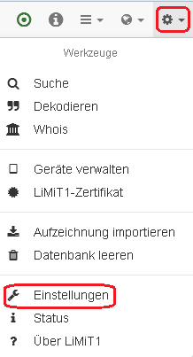
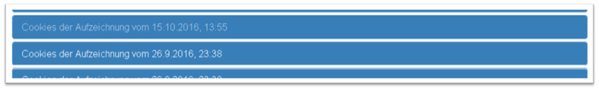
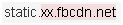
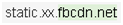
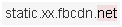

# LiMiT1

Software, um einen Raspberry Pi 3 oder 2 für eine WLAN-basierte Datenaufzeichnung und -analyse zu nutzen.

## Überblick
Bei LiMiT1 handelt sich um ein System, das dabei hilft, den Internet-Datenverkehr eines WLAN-fähigen Geräts (Smartphone, Tablet, Laptop, Smart-TV, IoT-Device, …) aufzuzeichnen und zu analysieren. Bei Geräten, auf denen ein eigenes Zertifikat installiert werden kann, ist dabei auch der Einblick in SSL-transportverschlüsselte Inhalte möglich.

Folgende Eigenschaften zeichnet LiMiT1 aus:

- Es sind keine oder nur geringfügige Anpassungen der Geräte erforderlich, deren Daten aufgezeichnet werden sollen.
- Insbesondere muss keine Software aufgespielt werden.
- Daher kann LiMiT1 zur Überprüfung der Datenflüsse nahezu jedes (WLAN-fähigen) Geräts eingesetzt werden.
- Das System bietet eine übersichtliche Web-Oberfläche, die auf eine einfache Nutzung und flexible Datenauswertung ausgerichtet ist.
- LiMiT1 ist daher auch von technisch weniger versierten Nutzern zu verwenden.
- Durch die Unterstützung des Internetzugangs über WLAN und UMTS und die Möglichkeit des Betriebs per Akku ist ein mobiler Einsatz möglich.

### LiMiT1?

"LiMiT" ist eine Abkürzung für "Licht in der Mitte des Tunnels". Der Begriff "Tunnel" steht dabei für die Verbindung eines Geräts mit dem Internet und die dabei übertragenen Daten, die normalerweise nicht (jedenfalls nicht einfach) zugänglich sind. Als sog. Man-In-The-Middle-Device kann LiMiT1 dabei helfen, Licht in diese ansonsten dunklen Datenflüsse zu bringen. Da es sich um die erste Version handelt, ergibt sich insgesamt der Name `LiMiT1`.

### Bestandteile

LiMiT1 besteht aus folgenden Teilen:

- Raspberry Pi 3 (bevorzugt)
- oder Raspberry Pi 2 mit hostap-fähigem WLAN-Adapter
- Stromversorgung
- SD-Karte mit konfigurierter LiMiT1-Software
- USB-Speicher-Stick

Zur Herstellung einer Internetverbindung ist zusätzlich mindestens eines der folgenden erforderlich:

- Netzwerkkabel mit Anschluss an ein LAN
- WLAN-Adapter
- UMTS-Stick

Zur Steuerung ist ein Laptop oder Smartphone erforderlich, zudem ggf. das Gerät, dessen Daten aufgezeichnet werden sollen. Sofern es über einen geeigneten Web-Browser verfügt, kann die Steuerung problemlos auch direkt durch das Gerät erfolgen, dessen Daten aufgezeichnet werden sollen.

### Konzept

LiMiT1 funktioniert wie jeder gewöhnliche Internet-WLAN-Router, indem er den über das aufgespannte WLAN angeschlossenen Geräten den Zugang ins Internet vermittelt. Zusätzlich zu dieser reinen Vermittlung finden weitere Prozesse statt:

- Die Daten, die zwischen dem angeschlossenen Gerät und dem Internet ausgetauscht werden, werden in einer Datenbank gespeichert.
- Soweit möglich, werden SSL-verschlüsselte Verbindungen umgeschlüsselt, so dass der Inhalt für die spätere Auswertung im Klartext vorliegt.

Zusätzlich zu dieser Routing-Funktion bietet LiMiT1 ein vielfältiges Set von Auswertungswerkzeugen, mit denen aufgezeichnete Daten betrachtet, durchsucht und analysiert werden können.

### Nutzungshinweis

**Diese Software wurde ausschließlich für den Zweck erstellt, um Einblick in Datenströme nehmen zu können, auf die zulässigerweise zugegriffen werden darf. Eine Verwendung für andere, insbesondere strafrechtlich verbotene Handlungen ist nicht bezweckt und wird ausgeschlossen.**

## Herstellung eines LiMiT1-Systems

Dieser Schritt besteht im Wesentlichen aus der Konfiguration einer SD-Karte. Hierfür werden benötigt:

- eine FAT32 formatierte Micro-SD-Karte mit mindestens 4 GB Kapazität,
- ein Raspberry Pi Modell 3 B (bevorzugt) oder 2 B,
- ein USB-Netzteil,
- eine USB-Tastatur,
- ein HDMI-fähiger Bildschirm,
- Internetanschluss per Ethernet,
- ein Raspian-Lite-Image (s.u.),
- Dateien [limitify.sh](./limitify.sh) und [limit1.tar.bz](./limit1.tar.bz) aus diesem Repository

### Raspian-Lite-Image dowloaden

Das Betriebssystem-Image kann unter <http://downloads.raspberrypi.org/raspbian_lite/images/raspbian_lite-2017-07-05/2017-07-05-raspbian-jessie-lite.zip> heruntergeladen werden (ca. 300 MB). Bitte nur diese aktuell unterstützte Fassung verwenden! Nach dem Entzippen der Datei steht das Raspberry-Lite-Image als .img-Datei zur Verfügung (ca. 1.7 GB).

### SD-Karte vorbereiten

Mit einem SD-Kartenimager (für Windows z.B. [Win32 Disk Imager](https://sourceforge.net/projects/win32diskimager/)) das Raspberry-Lite-Image auf die SD-Karte schreiben. Unter Windows sinkt die scheinbare Größe der SD-Karte danach auf wenige MB, da der Rest der Karte vom Linux-System benutzt wird.

Anschließend die Dateien [limitify.sh](./limitify.sh) und [limit1.tar.bz](./limit1.tar.bz) aus diesem Repository auf die SD-Karte kopieren. Hierfür ist noch genügend Platz auf der FAT-formatierten und unter Windows sichtbaren Partition `boot`.

### Gerät starten

Den Raspberry Pi mit Tastatur, Bildschirm und Etherent verbinden und die vorbereitete SD-Karte einsetzen. Das Gerät anschließend mit Hilfe des USB-Netzteils in Betrieb nehmen. Nach kurzer Zeit ist das Raspbian-System initialisiert und es steht ein Login-Prompt zur Verfügung.

### Software konfigurieren

Als Nutzer `pi` mit Passwort `raspberry` anmelden. Bitte beachten: Da zunächst die englische Tastatur eingestellt ist, sind `[ y ]` und `[ z ]` vertauscht; zudem ist das Zeichen `[ / ]` unter der Taste `[ - ]` zu finden, `[ * ]` unter `[ ( ]`.

Anschließend ausführen

`$ cd /boot`

`$ sudo bash ./limitify.sh`

Dabei können zusätzlich folgende Optionen verwendet werden:

Option| Parameter | Bedeutung
---|---|---
-r | password | set root password
-l | country.coding | set system locale
-L | | list available locales and exit
-t | timezone | set system timezone
-T | | list available timezones and exit
-s | ssid | set default ssid for LiMiT1 wifi
-p | password | set default password for LiMiT1 wifi
-c | channel | set default wifi channel

Soll z.B. der WLAN-Kanal auf 10 und die Zeitzone auf Madrid gesetzt werden, müssen folgende Optionen ergänzt werden:

`$ sudo bash ./limitify.sh -c 10 -t "Europe/Madrid"`

Das Skript führt eine Vielzahl von Operationen - insbesondere ein System-Update - durch, so dass der Gesamtvorgang (je nach Hardware, Internetgeschwindigkeit und Aktualisierungsbedarf) mehrere (bis zu 30) Minuten dauern kann. Dabei scheint das System immer wieder lange Zeit inaktiv zu sein. Dies ist jedoch nicht der Fall, wie der Blick auf die grüne SYstem-LED zeigt. Sie flackert jeweils, um die entsprechenden Schreibzugriffe auf die SD-Karte zu signalisieren. 

Nach Abschluss des Vorgangs rebootet das System. Es ist ein zusätzlicher Nutzer `root` mit Passwort `limit1` eingerichtet, der für den Systemzugriff verwendet werden kann (hierfür steht über das WLAN-Interface auch ein SSH-Server zur Verfügung). Es ist nun auch das deutsche Tastaturlayout wie gewohnt verwendbar. 

LiMiT1 ist jetzt prinzipiell einsatzbereit, für den erfolgreichen Betrieb sind aber unbedingt die Inbetriebnahme-Hinweise (s.u.) zu beachten. Sofern nicht bereits alle erforderlichen Hardware-Bestandteile eingebaut sind, sollte das System zunächst mittels `# halt` (bzw. `$ sudo halt`) heruntergefahren werden.

## Inbetriebnahme von LiMiT1

LiMiT1 wird durch Anschließen an die Stromversorgung gestartet. Ein erfolgreicher Start ist nur möglich, wenn

- eine SD-Karte mit der LiMiT1-Software im SD-Kartenslot und
- ein FAT32-formatierter USB-Speicherstick
 
eingesteckt sind. Tastatur und Bildschirm sind nicht erforderlich.

Wird ein Raspberry Pi 2 verwendet, muss zusätzlich ein für den HostAP-Betrieb geeigneter USB-WLAN-Dongle eingesteckt worden sein. Ein erfolgreich getesteter WLAN-Stick ist Ralink RT5370 (USB-ID 148f:5370). Mehr Details unter <http://elinux.org/RPI-Wireless-Hotspot> und <http://elinux.org/RPi_USB_Wi-Fi_Adapters>.  

Während der Startphase blinkt die grüne LED von LiMiT1. Sie erlischt, sobald LiMiT1 einsatzbereit ist; dies dauert einige Sekunden. Befindet sich noch keine LiMiT1-Datenbank auf dem Speicherstick, kann der Start länger dauern.

Tritt ein Fehler beim Start auf (z.B. kein WLAN-Dongle erkannt), blinkt die LED schnell oder leuchtet permanent; ein Einsatz des Geräts ist dann nicht möglich.

Als Stromquelle ist neben einem Netzteil mit Mikro-USB-Anschluss auch ein entsprechender Akku ("Powerbank") geeignet. Die Stromquelle sollte mehr als 1 A (1000 mA) bereitstellen, damit LiMiT1 stabil funktioniert.

## Verbindung zu LiMiT1

Nach dem Start stellt das System ein WLAN zur Verfügung, über das sich andere Geräte  mit LiMiT1 verbinden können. Der Zugriff erfolgt über eine Web-Schnittstelle, d.h. den Internet-Browser.

Die SSID, das Passwort und die IP-Adresse bzw. Domainnamen, unter dem LiMiT1 erreichbar ist, können in den [Einstellungen](#einstellungen) geändert werden. Direkt nach der Installation gelten folgende Standardwerte:

Parameter | Standardwert
--- | ---
SSID | limit1
WLAN-Passwort |	limit1limit
lokales Netzwerk | 172.16.0.0 .. 172.16.0.255
eigene IP-Adresse | 172.16.0.1
Domainname | lim.it1

## Erstinbetriebnahme

### Einstellungen

Zunächst sollte das Gerät individuell angepasst werden. Hierzu dient das Menü Werkzeuge/Einstellungen:

Es sollte zumindest das WLAN-Passwort geändert werden. Beim ersten Start von LiMiT1 sind folgende Werte eingestellt:

Parameter | Standardwert | Änderung?
--- | --- | ---
SSID | limit1 | bei Bedarf
WLAN-Passwort |	limit1limit | dringend empfohlen
lokales Netzwerk | 172.16.0.0 .. 172.16.0.255 | bei Bedarf
eigene IP-Adresse | 172.16.0.1 | bei Bedarf
Domainname | lim.it1 | bei Bedarf
http-Ports | alle bis auf 443 | abhängig von den verwendeten Ports der untersuchten Geräte
ssl-Ports | 443 (https) | abhängig von den verwendeten Ports der untersuchten Geräte

Zudem können verschiedene Ansichtsparameter verändert werden. Bei manchen Änderungen ist ein Neustart erforderlich, bevor sie wirksam werden.

### Zertifikat

LiMiT1 wird aus Sicherheitsgründen ohne Standard-Zertifikat ausgeliefert. Vor der ersten Aufzeichnung muss daher ein individuelles Zertifikat erzeugt werden (siehe [Zertifikat](#zertifikat)) und dieses auf den Geräten installiert werden, deren verschlüsselter Datenverkehr aufgezeichnet werden soll.

# Bedienung

LiMiT1 wird über die Menüleiste im oberen Bereich des Fensters bedient. Die Weboberfläche ist responsive und passt ihr Aussehen an die Bildschirmgröße an. Auf einem Smartphone etwa wird die Menüleiste durch ein Drop-Down-Menü ersetzt.

Im Desktop-Broswer sieht dies z.B. so aus:

Die MEnüleiste enthält links Funktionen, die teilweise über Drop-Down-Menüs erreichbar sind und im rechten Bereich einige Utility-Boxen. Von links nach rechts sind folgende Funtionen bzw. Menüs vorhanden:

- Aufzeichnung starten bzw. stoppen
- Status-Fenster einblenden
- Auswertungsfunktionen
- Internetverbindung herstellen und trennen
- Werkzeuge
- Ausschalten

Rechts stehen folgende Utility-Boxen zur Verfügung:

- Suche
- Dekodieren
- Whois

Die Utility-Boxen können in den [Einstellungen](#einstellungen) ein- und ausgeblendet werden.

## Aufzeichnung starten bzw. stoppen

Mit dieser Funktion wird eine Daten-Aufzeichnung gestartet und anschließend wieder gestoppt. Dazu muss LiMiT1 [online](#internetverbindung-herstellen-und-trennen) sein und es muss ein [Zertifikat](#zertifikat) vorhanden sein.

Nach Beendigung der Aufzeichnung müssen eventuell noch restliche Daten in die Datenbank übernommen werden, bevor deren Auswertung möglich ist. Dies wird durch ein Datenbank-Icon an dem Menüpunkt angezeigt.

## Status-Fenster einblenden

Mit dieser Funktion wird ein Status-Fenster eingeblendet, mit dem der aktuelle Betriebszustand von LiMiT1 erkennbar ist.

## Auswertungsfunktionen

### Aufzeichnungen

Mit dieser Funktion können die vorhandenen Aufzeichnungen eingesehen, angepasst, exportiert und gelöscht werden.

Jede Aufzeichnung besteht aus Verbindungen des Typs http, https, tcp, ssl oder udp. Verbindungen des Typs http und https bestehen zusätzlich aus Requests. Über entsprechende Drill-Down-Möglichkeiten kann auf diese jeweiligen Datailebenen zugegriffen werden.

### Eigenschaften

Diese Funktion ermöglicht den schnellen Überblick, welche der für ein mit einer Aufzeichnung verbundenes Gerät definierten Eigenschaften in den aufgezeichneten Daten enthalten ist.

Sie stellt dabei einen Schnellzugriff auf die Suchfunktion (siehe 4.5.1) dar, wobei jedoch bereits im Vorweg erkennbar ist, dass die Suche Treffer findet.

### Inhalte

Mit dieser Funktion können die Inhalte, die von http- oder https-Verbindungen übertragen werden einzeln betrachtet und analysiert werden. Bei diesen Inhalten kann es sich um Bilder, Javascript-Programme, Textdateien, PDF-Dokumente etc. handeln.

### Bilder

Die in http- oder https-Verbindungen übertragenen Bilder können mit dieser Funktion rasch identifiziert und betrachtet werden. Die Funktion stellt insofern eine Spezialisierung der Auswertung [Inhalte](#inhalte) dar, bietet zudem aber noch eine Vorschau auf die Bilder.

### Metadaten

In einer Reihe von Inhalten sind Metadaten wie Kommentare oder Titel enthalten. Solche Daten werden von dieser Funktion angezeigt.

### HTTP-Header

In den Header-Zeilen von http- oder https-Requests bzw. -Responses lassen sich häufig interessante Daten finden. Mit dieser Funktion können solche Daten identifiziert werden.

### Cookies

Die in http- oder https-Verbindungen übertragenen Cookies werden mit dieser Funktion ausgewertet. Es sind sowohl empfangene als auch versandte Cookies zugänglich.

### Verweise

Es gibt verschiedene Tehniken, mit denen ein Server auf einen anderen verweist, z.B. mittels des Referer-Headers. Diese Funktion stellt sämtliche solcher Verweise übersichtlich zusammen.

### SSL-Verschlüsselung

Eine SSL-Verschlüsselung kann in vielerlei Hinsicht parametrisiert sein, z.B. in Hinblick auf die Schlüssellänge oder den Verschlüsselungsalgorithmus. Die unterschiedlichen SSL-Varianten der aufgezeichneten Verbindungen (https oder ssl) können mit dieser Funktion analysiert werden.

### Zertifikate

Zu jeder SSL-Verschlüsselung gehört serverseitig ein Zertifikat, mit dem der Server sich identifiziert und seine Vertrauenswürdigkeit im Zusammenhang mit einem der Root-Zertifikate des Browsers belegt. Welche Zertifikate in den aufgezeichneten Daten enthalten sind, lässt diese Funktion erkennen.

## Internetverbindung herstellen und trennen

Über dieses Menü kann der Internetzugang gesteuert werden. LiMiT1 ist standardmäßig nicht mit dem Internet verbunden. Um Daten aufzuzeichnen, muss zuvor eine Verbindung hergestellt werden.

Vorhandene Aufzeichnungen können jedoch auch ohne Internetverbindung ausgewertet werden (siehe allerdings [Whois](#whois)). 

### LAN
Die Internetverbindung über den LAN-Anschluss herstellen. Es wird DHCP und manuelle Einstellung unterstützt.

### WLAN

Die Internetverbindung über einen zusätzlichen WLAN-Adapter herstellen. Der Adapter muss die nl80211 API unterstützen. Die Funktion ist nur verfügbar, wenn ein solcher Adapter eingesteckt ist.

Es wird die Auswahl eines der erkannten WLAN in der Umgebung und die manuelle SSID-Eingabe unterstützt.

### UMTS

Die Internetverbindung über einen UMTS-Adapter  (Surfstick) herstellen. Die Funktion ist nur verfügbar, wenn ein solcher Adapter eingesteckt ist.

Unterstützt werden aktuell mindestens die Modelle ZTE MF 823 (USB-ID 19d2:1405) und Huawei E3531 (USB-ID 12d1:15ca).

### Offline

Die Internetverbindung trennen. Die Funktion ist nur verfügbar, wenn eine Internetverbindung besteht.

## Werkzeuge

In diesem Menü sind Funktionen versammelt, die nicht direkt mit der Aufzeichnung oder Auswertung von Daten verbunden sind, diese aber sinnvoll unterstützen.

### Suche

Mit dieser Funktion, die auch über eine Utility-Box erreichbar ist, können die aufgezeichneten Daten flexibel durchsucht werden. Neben einer einfachen Suche stehen auch komplexere reguläre Ausdrücke als Suchkriterium zur Verfügung (Musterzeichen).
Die Ergebnisliste enthält neben Angaben zum Fundort den jeweiligen Kontext der Fundstelle, z.B. (Suche nach `alle`):

Befinden sich in dem Fundort weitere Fundstellen des Suchbegriffs, kann über die Navigationsbuttons durch die einzelnen Fundstellen navigiert werden.

Das Suchergebnis kann – je nach [Einstellung](#einstellung) – standardmäßig in einem eigenen Browser-Tab angezeigt werden.

### Dekodieren

Häufig sind kodierte Inhalte in den aufgezeichneten Daten enthalten. Diese Funktion, die auch über eine Utility-Box erreichbar ist, ermöglicht es, den Klartext solcher Inhalte anzuzeigen. Dabei werden verschiedene gängige Kodierungstechniken wie Base64 oder URL-Encode berücksichtigt und ggf. auch iterativ angewandt. Dies hat zur Folge, dass viele vermeintliche Dekodierungen angezeigt werden, die tatsächlich nicht bestehen. Allerdings besteht so eine größere Chance, auch die korrekte Kodierung zu berücksichtigen.

Das Dekodieren kann – je nach [Einstellung](#einstellung) – in einem eigenen Browser-Tab angezeigt werden.

### Whois

Diese Funktion, die auch über eine Utility-Box erreichbar ist, dient zur Hintergrundrecherche von aufgezeichneten Domainnamen. Für den angegebenen Domainnamen wird die in der LiMiT1-Datenbank vorhandene Whois-Information angezeigt. Bei Bedarf oder auf Anforderung wird zuvor eine Whois-Abfrage durchgeführt, um die Daten zu ergänzen bzw. zu aktualisieren. Hierfür ist eine Internetverbindung erforderlich.

Die Whois-Abfrage kann – je nach [Einstellung](#einstellung) – in einem eigenen Browser-Tab angezeigt werden.

Die Whois-Abfrage ist auch aus Tabellen aus erreichbar, in denen Domainnamen angezeigt werden, siehe [Whois-Informationen](#whois-informationen).

### Geräte verwalten

Da davon auszugehen ist, dass bestimmte Geräteeigenschaften wie MAC-Adresse, Werbe-ID usw. in den übertragenen Daten enthalten und dort von besonderem Interesse sind, können solche Eigenschaften gespeichert werden. Das Auffinden solcher Übertragungen wird dadurch erleichtert.

Es können beliebige Geräte mit beliebigen Eigenschaften definiert werden. Bereits definierte Geräte können einer Aufzeichnung zugeordnet werden (auch nachträglich). Da die  Auswertungsfunktion den jeweils aktuellen Satz an Eigenschaften eines Geräts berücksichtigt, können jederzeit (auch nachträglich) Eigenschaften ergänzt oder geändert werden.

### Zertifikat

Damit LiMiT1 auch SSL-verschlüsselte Inhalte im Klartext aufzeichnen kann, wird ein Zertifikat benötigt, das dem Gerät, dessen Daten aufgezeichnet werden, bekannt ist. LiMiT1 baut dann zwei getrennte SSL-Verbindungen auf – eine zu dem untersuchten Gerät und eine andere zu dem Internet-Server, den das Gerät anspricht.
Mit dieser Funktion kann ein solches Zertifikat erzeugt werden und auf das Gerät heruntergeladen werden, mit dem LiMiT1 gesteuert wird. Auf jedem Gerät, dessen SSL-verschlüsselte Daten im Klartext aufgezeichnet werden sollen,  muss das Zertifikat installiert werden, bevor die Aufzeichnung erfolgt.

### Aufzeichnung importieren

Mit dieser Funktion  kann eine exportierte Aufzeichnung wieder reimportiert werden. Dies ist auch zwischen verschiedenen LiMiT1-Systemen möglich, so dass Aufzeichnungen zwischen verschiedenen Verwendern ausgetauscht werden können.

Zum Zeitpunkt des Imports sollte eine Internetverbindung bestehen, damit IP-Adressen und Domainnamen korrekt aufgelöst werden können.

### Datenbank leeren

Wenn keine der Aufzeichnungen mehr benötigt wird, kann die Datenbank mit dieser Funktion komplett gelöscht werden.

### Einstellungen

Mit dieser Funktion kann LiMiT1 individuell angepasst werden.

### Status

Über diese Funktion sind detaillierte Systeminformationen abrufbar.

### Updates

Es wird online überprüft, ob eine neue Version verfügbar ist. Neue Versionen können direkt installiert und LiMiT1 so auf den neusten Stand gebracht werden.

### Über LiMiT1

Mit diesem Menüpunkt werden u.a. Lizenzinformationen angezeigt.

## Ausschalten

Das Gerät kann neu gestartet oder komplett heruntergefahren werden. LiMiT1 sollte erst nach dem Herunterfahren von der Stromversorgung getrennt werden.

## Allgemeine Bedienungshinweise

### Hilfe

Auf vielen Seiten ist über das Fragezeichen-Icon eine kompakte Hilfe zu der entsprechenden Funktion verfügbar.

### Utility-Boxen

In die Boxen kann wie gewöhnlich Text eingegeben werden. Bei den meisten Browsern ist auch ein Drag-and-Drop möglich, so dass eine markierte Textstelle einfach in die Box gezogen werden kann, ohne dass Copy-Paste nötig ist.

Mit Auslösen der Funktion (Suche, …) wird der eingegebene Wert in der Box wieder gelöscht, so dass der nächste Wert ohne manuelles Löschen des alten Werts eingegeben werden kann.

### Entfaltbare Bereiche

Um die teilweise umfangreichen Ergebnisse einer Auswertung kompakt anzuzeigen, sind diese häufig in entfaltbaren Boxen enthalten, z.B.

Solche Bereiche können durch Klick auf den Titel individuell aus- und eingeklappt werden, um den Inhalt anzuzeigen bzw. zu verbergen:

Die Titel von Boxen ohne Inhalt (im Beispiel: keine Cookies) werden dabei grau statt weiß angezeigt, so dass das unnötige Aufklappen leerer Boxen vermieden werden kann.

### Tabellen

Sämtliche Tabellen verfügen über folgende Features:

- Seitenweise Darstellung: Beschränkung der Zeilenanzahl pro Seite bzw. Anzeige aller Zeilen auf einer Seite.
- Suchfilter: Begrenzung der Anzeige auf diejenigen Zeilen, die einen entsprechenden Inhalt (in einer der Spalten) haben.
- Tabellenfaltung: Lange Spalteneinträge werden standardmäßig gekürzt bzw. abgeschnitten dargestellt, um die Darstellung kompakt zu halten. Über den grünen Ausklapp- bzw. orangenen Einklappbutton kann zwischen der kompakten und der vollständigen Darstellung gewechselt werden. Der Wechsel ist auch in gekürzten Spalten durch (Rechts)Klick möglich.
- Sortierung: Die meisten Spalten können sortiert werden. Eine Mehrfachsortierung ist unter Verwendung der Shift-Taste möglich.
- Seitennavigator: Bei seitenweise dargestellten Tabellen kann durch die einzelnen Seiten geblättert werden.

### Whois-Informationen

Die [Whois-Abfrage](#whois) ist auch aus Tabellen erreichbar, in denen Domainnamen angezeigt werden. Für den Teil eines Domainnamens, auf den der Mauszeiger zeigt, kann durch Mausklick eine Whois-Abfrage gestartet werden. Dabei wird der Namensteil grün hinterlegt, wenn in der Datenbank bereits Whois-Informationen vorhanden sind, ansonsten wird er rot hinterlegt, z.B.

Ansicht | Bedeutung
--- | ---
 | Whois-Daten zu `xx.fbcdn.net` sind nicht vorhanden, werden aber durch Klick geladen (bei vorhandener Internetverbindung)
 | Whois-Daten zu `fbcdn.net` sind in der Datenbank vorhanden und werden durch Klick angezeigt
 | Whois-Daten zu `.net` sind nicht vorhanden, werden aber durch Klick geladen (bei vorhandener Internetverbindung)

